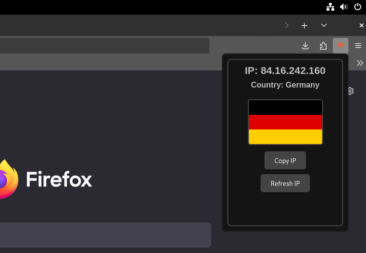
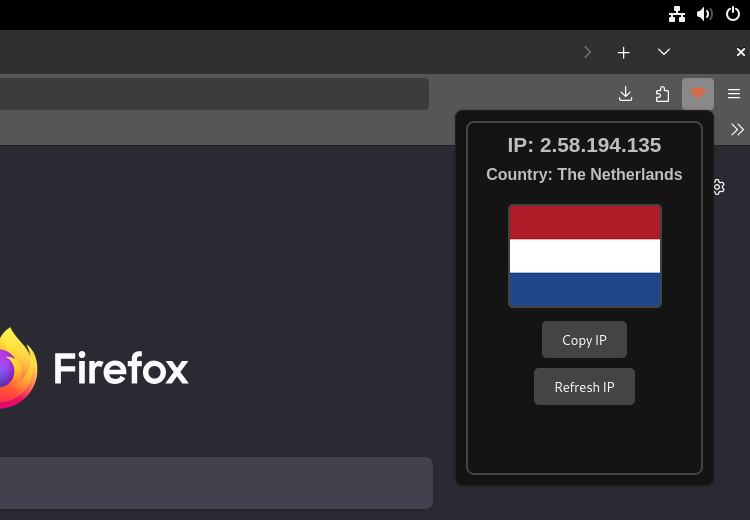
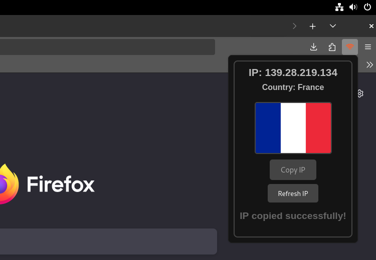

  

# Firefox extension that displays the IP address and flag of the associated country.

## Overview

**[IP Tracker:](https://addons.mozilla.org/es-ES/firefox/addon/ip-tracker/)** is a lightweight and user-friendly extension designed to display the user's current public IPv4 address and country flag. It leverages external APIs to fetch IP and geolocation data and includes a caching mechanism to prevent excessive API requests. Additionally, it features a refresh button with a cooldown and a visual animation to enhance the user experience.

## Screenshots

  
  
  

## Features

- **Automatic IP Detection:** Retrieves and displays the user's public IPv4 address and country flag upon extension loading.
- **Copy IP to Clipboard:** A button to copy the IP address with a smooth animation.
- **Manual Refresh with Cooldown:** Allows refreshing the IP address up, with a 5-second cooldown between requests.
- **Caching Mechanism:** Stores IP data in local storage for up to 1 hour to avoid excessive API requests.
- **Loading Animation:** A spinning icon to indicate data fetching.
- **Error Handling:** Displays error messages when API requests fail.

## Technologies Used

- **HTML5** for the user interface.
- **CSS3** for styling and animations.
- **JavaScript (Vanilla)** for logic and API integration.

## APIs Used

1. **IPify API** (`https://api4.ipify.org?format=json`): Provides the user's public IPv4 address.
2. **IPAPI** (`https://ipapi.co/{ip}/json/`): Returns geolocation data, including the country name and code.

## How It Works

### 1. Caching Mechanism
- The extension caches the IP data in `localStorage` for one hour to reduce API calls.
- When the extension loads, it first checks the cache. If the data is expired or absent, it fetches new data from the APIs.

### 2. Copy to Clipboard
- The "Copy IP" button allows users to copy the IP address to the clipboard.
- A visual feedback animation confirms the successful copy action.

### 3. Refresh with Cooldown
- The "Refresh IP" button allows users to manually update the IP address.
- 5-second cooldown between each request.
- A counter displays the remaining refresh attempts.

### 4. Error Handling
- If the API requests fail, an error message is displayed to inform the user.

## Usage Instructions

1. Install the extension in your browser.
2. Open the extension to automatically fetch and display your IP address and country flag.
3. Click the **"Copy IP"** button to copy the IP address.
4. Use the **"Refresh IP"** button to manually update the IP address (5-second cooldown).

## Code Structure

- **HTML Structure:** Defines the layout, buttons, and containers for IP and country data.
- **CSS Styling:** Manages the dark theme, animations, and responsive design.
- **JavaScript Logic:** Handles API requests, caching, clipboard copying, refresh cooldown, and error management.

## Limitations

- The extension depends on external APIs, so internet access is required.
- IPv6 addresses are not supported; the extension focuses solely on IPv4.

## License

This project is open-source and available under the Apache 2.0 License.
